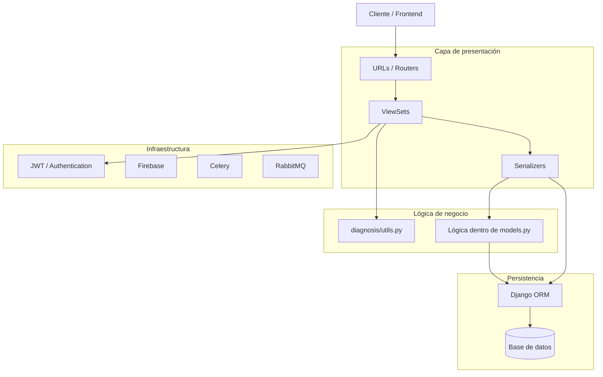
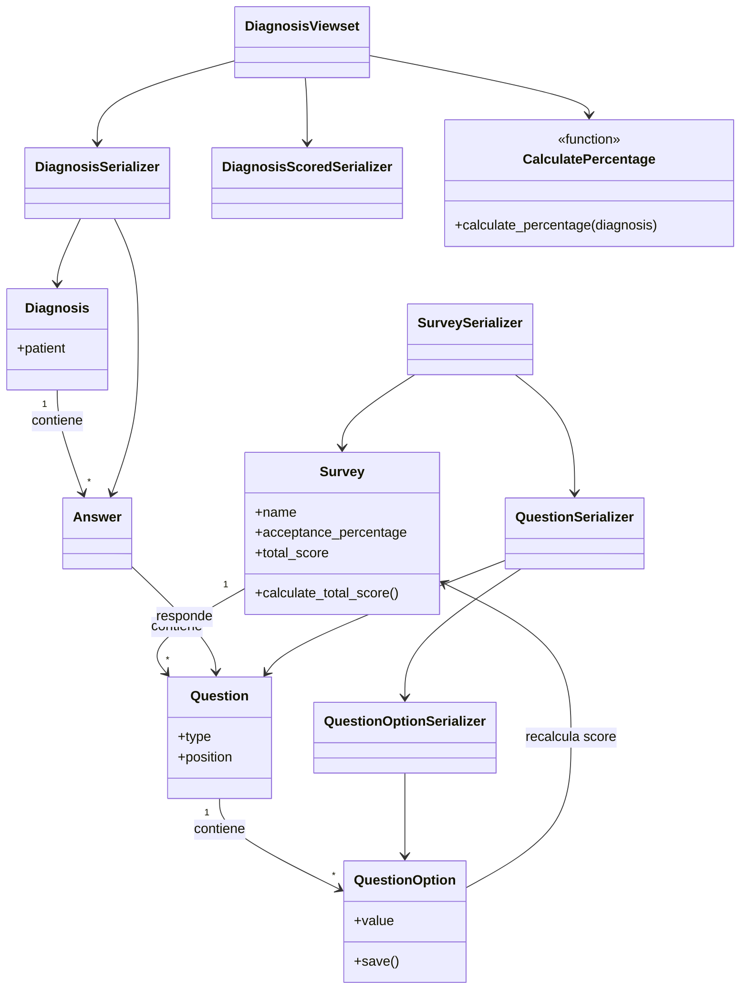

# Backend 1 — Análisis de arquitectura

## 1. Capas de la aplicación

El proyecto está construido sobre Django 3 y Django REST Framework.

A partir de la estructura actual se pueden identificar las siguientes capas:

### Capa de presentación / API

Se encarga de recibir las solicitudes HTTP, exponer los endpoints REST y devolver las respuestas.

Los principales componentes de esta capa se encuentran en:

- `corozina/urls.py`
- `diagnosis/api/urls.py`
- `diagnosis/api/viewsets.py`
- `diagnosis/api/serializers.py`

El proyecto utiliza `DefaultRouter` de Django REST Framework para registrar los `ViewSet` del módulo `diagnosis`.

Los principales endpoints identificados son:

- `/api/v1/auth/token/`
- `/api/v1/auth/token/refresh/`
- `/api/v1/diagnosis/survey/`
- `/api/v1/diagnosis/question/`
- `/api/v1/diagnosis/question-option/`
- `/api/v1/diagnosis/diagnosis/`
- `/api/v1/chat/`

El archivo `diagnosis/views.py` existe, pero actualmente no contiene lógica de presentación relevante. La API del módulo está implementada principalmente en `diagnosis/api/viewsets.py`.

### Capa de lógica de negocio

El proyecto no posee una capa de servicios claramente definida.

La lógica de negocio se encuentra distribuida entre diferentes componentes:

- `diagnosis/utils.py`
- `diagnosis/models.py`
- `diagnosis/api/serializers.py`
- `diagnosis/api/viewsets.py`

Por ejemplo:

- `calculate_percentage()` calcula y persiste el resultado de un diagnóstico.
- `QuestionOption.save()` provoca el recálculo del puntaje total de una encuesta.
- Los serializers crean directamente entidades relacionadas.
- `DiagnosisViewset.finalize_response()` ejecuta lógica relacionada con el cálculo final del diagnóstico.

Esta distribución genera acoplamiento entre responsabilidades de presentación, dominio y persistencia.

### Capa de persistencia

La persistencia se implementa principalmente utilizando el ORM de Django.

Los modelos se encuentran distribuidos entre las diferentes aplicaciones:

- `diagnosis/models.py`
- `auth/models.py`
- `firebase/models.py`
- `chat/models.py`
- `userprofile/models.py`

Sin embargo, los serializers también realizan operaciones directas de persistencia mediante llamadas como:

```python
Model.objects.create(...)
```

Por este motivo, la responsabilidad de persistencia no se encuentra completamente aislada.

### Capa de infraestructura e integración

Esta capa contiene elementos relacionados con configuración del proyecto y servicios externos.

Entre ellos se encuentran:

- configuración de Django en `corozina`;
- autenticación JWT;
- integración con Firebase;
- Celery;
- RabbitMQ;
- configuración de WSGI/ASGI.

### Diagrama de capas



El diagrama muestra que la arquitectura no sigue una separación estricta por capas, ya que `serializers`, `models` y `viewsets` participan directamente en lógica de negocio.

---

## 2. Responsabilidad de cada paquete

### `corozina`

Corresponde al paquete principal de configuración del proyecto Django.

Entre sus responsabilidades se encuentran:

- configuración general mediante `settings`;
- definición de rutas principales;
- configuración de WSGI y ASGI;
- configuración relacionada con Celery;
- configuración global de componentes instalados.

Actúa como punto de entrada y configuración del proyecto.

### `diagnosis`

Es el paquete principal del dominio de negocio.

Se encarga de manejar:

- encuestas;
- preguntas;
- opciones de respuesta;
- diagnósticos;
- respuestas;
- cálculo de puntajes;
- cálculo del porcentaje final de diagnóstico.

También contiene los serializers, ViewSets y rutas REST asociadas con este dominio.

### `auth`

Se encarga de la autenticación personalizada.

Incluye componentes relacionados con:

- autenticación de usuarios;
- generación de tokens JWT;
- autenticación mediante redes sociales.

### `firebase`

Su responsabilidad es la integración con Firebase Cloud Messaging.

Permite gestionar tokens de dispositivos y enviar notificaciones push.

### `chat`

Se encarga de la funcionalidad de mensajería.

Dentro de este paquete se encuentran entidades relacionadas con:

- hilos de conversación;
- mensajes.

Su objetivo es permitir comunicación entre los actores del sistema.

### `userprofile`

Extiende la información del usuario.

Contiene el modelo `Profile`, utilizado para almacenar información adicional y diferenciar tipos de usuario, como pacientes y doctores.

---

## 3. Responsabilidad de las clases del paquete `diagnosis`

El paquete `diagnosis` contiene los principales elementos relacionados con el proceso de diagnóstico.

### Modelos

#### `Survey`

Representa una encuesta utilizada para realizar un diagnóstico.

Entre sus responsabilidades se encuentran:

- almacenar el nombre de la encuesta;
- definir el porcentaje de aceptación;
- mantener el puntaje total;
- agrupar preguntas relacionadas con la encuesta.

También contiene lógica relacionada con el cálculo del puntaje total.

#### `Question`

Representa una pregunta perteneciente a una encuesta.

Sus responsabilidades principales son:

- almacenar el contenido de la pregunta;
- indicar su tipo;
- mantener su posición dentro de la encuesta;
- relacionarse con una instancia de `Survey`.

#### `QuestionOption`

Representa una posible respuesta para una pregunta.

Contiene información como el valor o puntaje asociado con la opción.

Al guardar una opción, el método `save()` provoca el recálculo del puntaje total de la encuesta asociada.

Esta responsabilidad genera un acoplamiento entre persistencia y lógica de negocio.

#### `Diagnosis`

Representa el resultado de un proceso de diagnóstico realizado por un paciente.

Relaciona:

- un paciente;
- una encuesta;
- las respuestas proporcionadas;
- el resultado calculado.

#### `Answer`

Representa una respuesta individual dentro de un diagnóstico.

Relaciona una pregunta con la respuesta proporcionada durante el proceso.

### Serializers

#### `QuestionOptionSerializer`

Se encarga de transformar y validar los datos asociados con una opción de respuesta.

#### `QuestionSerializer`

Serializa las preguntas y gestiona sus opciones relacionadas.

Durante algunos procesos también participa directamente en la creación de objetos relacionados.

#### `SurveySerializer`

Transforma los datos de una encuesta y gestiona la creación o actualización de preguntas y opciones asociadas.

Actualmente contiene lógica de persistencia mediante llamadas directas al ORM.

#### `AnswerSerializer`

Gestiona la representación y validación de las respuestas pertenecientes a un diagnóstico.

#### `DiagnosisSerializer`

Gestiona la creación de diagnósticos y respuestas relacionadas.

Durante el proceso de creación instancia otros serializers y crea entidades asociadas.

#### `DiagnosisScoredSerializer`

Representa un diagnóstico incluyendo la información relacionada con su resultado o puntaje.

### ViewSets

#### `SurveyViewSet`

Expone las operaciones REST asociadas con las encuestas.

#### `QuestionViewSet`

Expone las operaciones relacionadas con preguntas.

#### `QuestionOptionViewSet`

Gestiona las operaciones REST de las opciones de respuesta.

#### `DiagnosisViewset`

Gestiona las operaciones relacionadas con los diagnósticos.

Además de tareas propias de presentación, actualmente participa en la lógica de negocio al ejecutar el cálculo del porcentaje mediante `finalize_response()`.

### Otros componentes

#### `MultiTypeResponseField`

Campo personalizado que extiende `CharField` de Django REST Framework.

Normaliza a string los valores que llegan como booleano, entero o flotante, para que las preguntas de tipo `YES_NO` puedan recibir `true`/`false` sin fallar la validación de tipo.

#### `calculate_percentage()`

Función definida en `diagnosis/utils.py`.

Calcula el score acumulado de un diagnóstico sumando el `answer_value` de todas sus respuestas, calcula el porcentaje sobre el `total_score` de la encuesta, persiste ambos valores en el `Diagnosis` y retorna un `DiagnosisScoredSerializer` listo para devolver al cliente.

Aunque funcionalmente actúa como un servicio de dominio, se encuentra implementada como una función utilitaria sin capa propia.

### Admin

#### `QuestionOptionTabularInline`

Configura la vista inline de `QuestionOption` dentro del panel de administración de `Question`. Solo tiene responsabilidad de presentación en el admin de Django.

#### `QuestionAdmin`

Registra `Question` en el admin de Django incluyendo sus opciones como inline. Solo tiene responsabilidad de presentación en el admin de Django.

### Configuración de la app

#### `DiagnosisConfig`

Metadatos de la aplicación para Django (`AppConfig`). Su única responsabilidad es declarar el nombre del paquete. No contiene lógica.

---

## 4. Relaciones y dependencias entre las clases de `diagnosis`

Las principales relaciones identificadas son:

- `Survey` contiene múltiples `Question`.
- `Question` pertenece a un `Survey`.
- `Question` puede contener múltiples `QuestionOption`.
- `Diagnosis` representa la ejecución de una encuesta por parte de un paciente.
- `Diagnosis` contiene múltiples `Answer`.
- `Answer` se relaciona con una pregunta del proceso de diagnóstico.

Además existen dependencias de implementación entre serializers, modelos, ViewSets y utilidades.

Por ejemplo:

- `DiagnosisViewset` utiliza `DiagnosisSerializer`.
- `DiagnosisViewset` utiliza `DiagnosisScoredSerializer`.
- `DiagnosisViewset` utiliza `calculate_percentage()`.
- `DiagnosisSerializer` crea entidades `Diagnosis` y `Answer`.
- `SurveySerializer` crea objetos `Survey`, `Question` y `QuestionOption`.
- `QuestionOption.save()` llama indirectamente a `Survey.calculate_total_score()`.
- `calculate_percentage()` depende del modelo `Diagnosis` y de `DiagnosisScoredSerializer`.

### Tipos de relaciones identificadas

#### Herencia

Las clases del paquete `diagnosis` utilizan principalmente herencia de clases proporcionadas por Django y Django REST Framework:

- `Survey`, `Question`, `QuestionOption`, `Diagnosis` y `Answer` heredan de `django.db.models.Model`.
- Los ViewSets heredan de `rest_framework.viewsets.ModelViewSet`.
- Los serializers utilizan las clases base de serializers de Django REST Framework.
- `MultiTypeResponseField` extiende `CharField`.
- `DiagnosisConfig` hereda de `django.apps.AppConfig`.
- Las clases de administración utilizan las clases base proporcionadas por `django.contrib.admin`.

No se identifica una jerarquía de herencia propia significativa entre las clases del dominio `diagnosis`; la herencia existente se utiliza principalmente para integrar los componentes con Django y Django REST Framework.

#### Composición y asociaciones del dominio

Las relaciones principales del modelo se construyen mediante asociaciones entre entidades:

- Un `Survey` agrupa múltiples `Question`.
- Una `Question` puede contener múltiples `QuestionOption`.
- Un `Diagnosis` agrupa múltiples `Answer`.
- Una `Answer` se relaciona con una `Question`.

Estas relaciones representan la estructura del proceso de diagnóstico y permiten construir una encuesta a partir de preguntas y opciones, y posteriormente almacenar las respuestas de un paciente dentro de un diagnóstico.

#### Acoplamiento con otros paquetes

El paquete `diagnosis` presenta principalmente acoplamiento con componentes del framework y con el sistema de usuarios:

- `Diagnosis` depende de `django.contrib.auth.models.User` para representar al paciente.
- Los modelos dependen del ORM de Django.
- Los serializers, ViewSets y campos personalizados dependen de Django REST Framework.
- `DiagnosisConfig` depende del sistema de configuración de aplicaciones de Django.
- Las clases del admin dependen de `django.contrib.admin`.

Dentro del propio paquete también existe acoplamiento entre capas. Por ejemplo, `calculate_percentage()` depende de `DiagnosisScoredSerializer`, mientras que `DiagnosisViewset` depende tanto de los serializers como de esta función de cálculo.

### Diagrama de clases



Una característica importante de estas dependencias es que algunas responsabilidades atraviesan diferentes capas.

Por ejemplo, `QuestionOption.save()` realiza una acción de negocio sobre `Survey`, mientras que `DiagnosisViewset` participa en el cálculo del resultado del diagnóstico.

Esto aumenta el acoplamiento entre componentes.

---

## 5. Riesgos de la arquitectura actual

Se seleccionaron tres riesgos principales considerando seguridad, mantenibilidad y capacidad de evolución del sistema.

### Riesgo 1 — `SECRET_KEY` almacenada en el código fuente

#### Problema

Se identificó una `SECRET_KEY` definida directamente dentro del código del proyecto.

Las claves utilizadas por Django deberían tratarse como secretos y no almacenarse dentro del repositorio.

#### Impacto

Si el repositorio fuera público o la clave fuera expuesta, un tercero podría obtener un secreto utilizado por la aplicación.

Esto representa un riesgo de seguridad y además dificulta manejar configuraciones diferentes entre ambientes como:

- desarrollo;
- pruebas;
- producción.

#### Mejora propuesta

Externalizar los secretos utilizando variables de entorno.

Por ejemplo:

```python
SECRET_KEY = os.environ["DJANGO_SECRET_KEY"]
```

El repositorio debería contener únicamente un archivo:

```text
.env.example
```

con los nombres de las variables requeridas, pero nunca los valores reales.

También debería evitarse que archivos `.env` sean versionados mediante `.gitignore`.

---

### Riesgo 2 — Ausencia efectiva de pruebas automatizadas

#### Problema

Las pruebas existentes en el proyecto no representan actualmente una red de seguridad funcional.

En `diagnosis/tests/test_views.py` las pruebas se encuentran deshabilitadas y no están configuradas para ejecutarse correctamente.

Los demás paquetes contienen archivos de pruebas vacíos o sin cobertura relevante.

Por lo tanto, el sistema no cuenta con pruebas automatizadas suficientes para detectar regresiones.

#### Impacto

La ausencia de pruebas incrementa considerablemente el riesgo de modificar o actualizar el proyecto.

Esto es especialmente importante para una migración desde:

```text
Python 3.7
Django 3.x
```

hacia versiones modernas.

Sin pruebas resulta difícil determinar si una actualización rompe:

- endpoints;
- autenticación;
- reglas de negocio;
- serializers;
- integración con servicios externos.

#### Mejora propuesta

Crear progresivamente una suite de pruebas automatizadas.

La prioridad debería ser cubrir:

1. autenticación;
2. creación de encuestas;
3. creación de diagnósticos;
4. cálculo del score;
5. relaciones entre preguntas y respuestas;
6. principales endpoints REST.

Las pruebas deberían ejecutarse automáticamente mediante un pipeline de integración continua.

De esta forma se obtiene una red de seguridad antes de realizar modificaciones importantes en la arquitectura o actualizar dependencias.

---

### Riesgo 3 — Lógica de negocio distribuida entre modelos, serializers y ViewSets

#### Problema

Actualmente la lógica de negocio se encuentra repartida entre diferentes componentes.

Ejemplos:

- `QuestionOption.save()` ejecuta lógica relacionada con el puntaje de una encuesta.
- `SurveySerializer` crea preguntas y opciones directamente.
- `DiagnosisSerializer` crea respuestas y diagnósticos.
- `DiagnosisViewset.finalize_response()` participa en el cálculo del resultado.
- `calculate_percentage()` se encuentra implementado como una función en `utils.py`.

Esto provoca que componentes diseñados principalmente para presentación o transformación de datos también ejecuten reglas de negocio.

#### Impacto

Esta distribución genera:

- alto acoplamiento;
- menor reutilización;
- pruebas más difíciles;
- dificultad para identificar dónde se encuentra una regla de negocio;
- mayor riesgo al modificar funcionalidades.

También puede generar dependencias circulares entre módulos.

#### Mejora propuesta

Introducir una capa explícita de servicios de dominio.

Por ejemplo:

```text
diagnosis/
├── models.py
├── services/
│   ├── diagnosis_service.py
│   └── survey_service.py
├── api/
│   ├── serializers.py
│   └── viewsets.py
```

Un servicio podría encargarse del proceso completo de creación de diagnóstico:

```python
class DiagnosisService:

    def create_diagnosis(self, patient, survey, answers):
        ...
```

De esta forma:

- los ViewSets manejan HTTP;
- los serializers validan y transforman datos;
- los servicios ejecutan reglas de negocio;
- los modelos representan y persisten el estado.

Esto reduce el acoplamiento y facilita probar las reglas de negocio de manera independiente.

---

## 6. Migración a Python 3.12 y Django 5.x

La migración no debería realizarse únicamente cambiando las versiones de Python y Django.

El proyecto utiliza varias dependencias y APIs correspondientes a versiones antiguas, por lo que sería necesario realizar una migración progresiva.

### Principales implicaciones

#### `ugettext_lazy`

El proyecto utiliza:

```python
from django.utils.translation import ugettext_lazy as _
```

`ugettext_lazy` fue eliminado en versiones modernas de Django.

Debe sustituirse por:

```python
from django.utils.translation import gettext_lazy as _
```

#### `USE_L10N`

La configuración:

```python
USE_L10N = True
```

fue deprecada y posteriormente eliminada en Django 5.

Por lo tanto, debería eliminarse o adaptarse la configuración correspondiente.

#### Dependencias antiguas

El proyecto utiliza diferentes librerías con versiones antiguas.

Entre ellas:

- Django 3.0.4;
- Django REST Framework 3.11;
- SimpleJWT 4.4;
- Celery 4.4;
- `django-rest-framework-social-oauth2`;
- Pillow 7;
- `pytz`;
- `six`.

Antes de actualizar Django sería necesario revisar la compatibilidad de cada dependencia.

Algunas podrían requerir una actualización y otras podrían necesitar ser sustituidas completamente.

#### Autenticación social

`django-rest-framework-social-oauth2` presenta un riesgo especial debido a su antigüedad y mantenimiento limitado.

La migración debería evaluar una alternativa compatible con versiones modernas de Django.

#### Celery

El proyecto utiliza Celery 4.x.

Una actualización hacia Celery 5 implica revisar la configuración y posibles cambios en nombres de variables y comportamiento.

#### `DEFAULT_AUTO_FIELD`

El proyecto no define explícitamente:

```python
DEFAULT_AUTO_FIELD
```

En versiones modernas de Django el valor predeterminado utiliza `BigAutoField`.

Esto podría generar nuevas migraciones o cambios en claves primarias si no se controla correctamente.

---

## Estrategia de migración propuesta

No realizaría directamente una actualización a Python 3.12 y Django 5.x.

Primero crearía una red de seguridad mediante pruebas automatizadas.

La secuencia propuesta sería:

```text
1. Construir pruebas sobre el comportamiento actual.
            ↓
2. Externalizar secretos y revisar configuración.
            ↓
3. Identificar dependencias incompatibles.
            ↓
4. Actualizar dependencias de terceros.
            ↓
5. Migrar progresivamente Django.
            ↓
6. Actualizar Python.
            ↓
7. Ejecutar nuevamente pruebas y corregir regresiones.
```

### ¿Qué haría primero?

El primer paso sería crear pruebas automatizadas sobre los flujos críticos del sistema.

Actualmente no existe una cobertura efectiva que permita verificar que la aplicación mantiene el mismo comportamiento después de una actualización.

Antes de cambiar versiones deberían cubrirse como mínimo:

- autenticación;
- creación de encuestas;
- creación de diagnósticos;
- cálculo del score;
- endpoints principales.

Una vez exista esta red de seguridad, comenzaría la actualización progresiva de dependencias y framework.

Esto reduce el riesgo de realizar una migración grande sin poder detectar regresiones.
