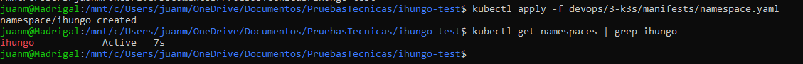
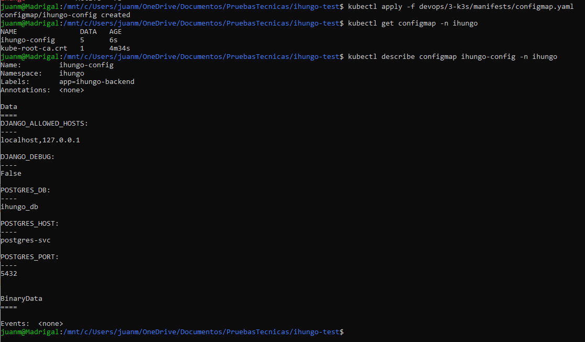
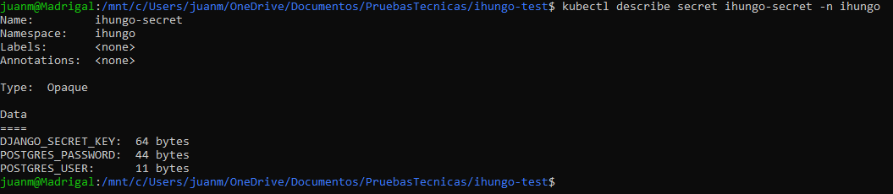
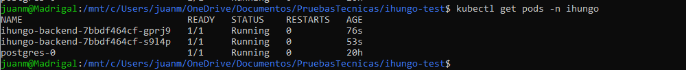
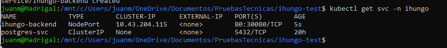
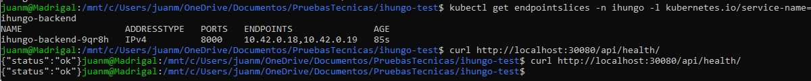
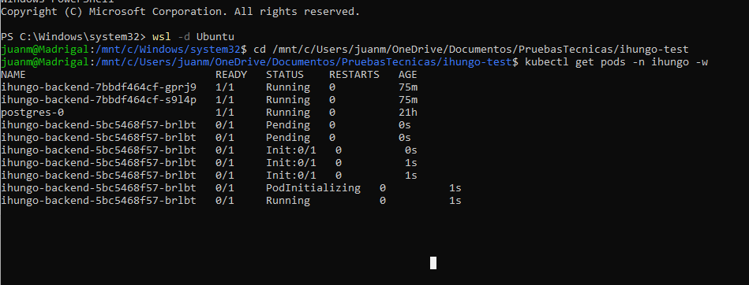
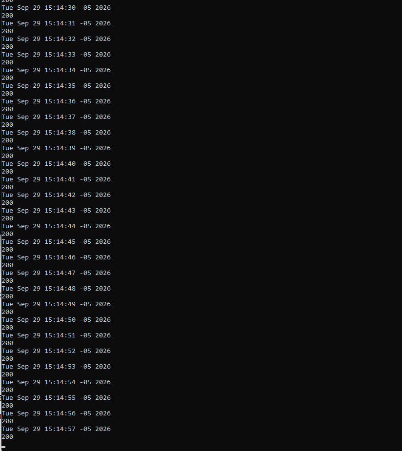
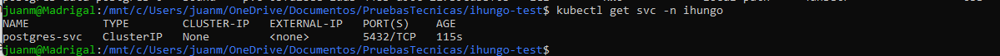

# EVIDENCIAS — Prueba Técnica Ihungo DevOps


# DevOps 1 — GitHub Actions → Docker Hub

## 1. Objetivo

Automatizar la validación, construcción, escaneo y publicación de la imagen Docker correspondiente al Backend 4 mediante GitHub Actions.

La imagen publicada corresponde a la API desarrollada en `backend/4-api/`.

El flujo implementado es:

```text
Push / Pull Request / Tag
          |
          v
   GitHub Actions
          |
          +--> Lint
          |
          +--> Tests + cobertura
          |
          +--> Docker Build
          |
          +--> Escaneo Trivy
          |
          +--> Push a Docker Hub
                 |
                 +--> main
                 +--> sha-<commit>
```

---

## 2. Repositorios utilizados

### Repositorio principal

GitLab:

```text
https://gitlab.com/personal-group5360139/ihungo-test
```

### Espejo para GitHub Actions

GitHub:

```text
https://github.com/JuanPaM17/ihungo-test
```

El repositorio de GitHub se utiliza como espejo del repositorio principal para ejecutar GitHub Actions.

---

## 3. Repositorio de Docker Hub

Repositorio público:

```text
https://hub.docker.com/r/juanpablomc/ihungo-backend
```

Página de etiquetas:

```text
https://hub.docker.com/r/juanpablomc/ihungo-backend/tags
```

Etiquetas verificadas:

```text
main
sha-6568187
```

También se utilizó inicialmente una etiqueta manual:

```text
test
```

para validar el flujo `docker build` + `docker push` antes de automatizarlo.

---

## 4. Pipeline implementado

Archivo:

```text
.github/workflows/ci-dockerhub.yml
```

El pipeline contiene dos bloques principales.

### 4.1. Job `Lint & Tests`

Se ejecuta antes de cualquier construcción de imagen.

Incluye:

```text
ruff check .
python manage.py makemigrations --check --dry-run
python manage.py migrate --noinput
pytest --cov=. --cov-report=term-missing --cov-report=xml --cov-fail-under=80
```

El objetivo es impedir que una imagen se publique si el código no supera previamente las validaciones de calidad.

### 4.2. Job `Build · Scan · Push`

Depende del job anterior.

Incluye:

- configuración de Docker Buildx;
- autenticación contra Docker Hub únicamente cuando corresponde;
- generación de metadatos y etiquetas;
- build local de la imagen;
- análisis de vulnerabilidades con Trivy;
- push de la imagen a Docker Hub para `main` y tags.

---

# 5. Evidencias

## Evidencia 1 — Ejecución exitosa en `main`

**Qué demuestra**

- que GitHub Actions se ejecutó correctamente;
- que `Lint & Tests` pasó;
- que `Build · Scan · Push` pasó;
- que el pipeline completo funciona desde `main`.

**Enlace al run**

[Ver ejecución en GitHub Actions](https://github.com/JuanPaM17/ihungo-test/actions/runs/36473605121)

**Captura**


---

## Evidencia 2 — Lint y pruebas exitosas

**Qué demuestra**

- que el código pasa `ruff`;
- que las migraciones están versionadas;
- que las pruebas automatizadas pasan;
- que se exige cobertura mínima del 80 %.

**Captura**


---

## Evidencia 3 — Build, escaneo y push

**Qué demuestra**

- que la imagen Docker se construye;
- que Trivy analiza la imagen;
- que la imagen se publica en Docker Hub.

**Captura**


---

## Evidencia 4 — Etiquetas trazables en Docker Hub

**Qué demuestra**

Que la imagen puede relacionarse con:

- una rama;
- una versión semántica;
- un commit específico.

Etiquetas utilizadas:

```text
main
sha-<commit>
```

**Captura**


# 6. Defectos identificados y corregidos — DevOps 1

La definición de referencia contenía defectos intencionales. Se corrigieron los siguientes.

## FIX-1 — Construcción sin validación previa

### Problema

El workflow de referencia construía y publicaba la imagen sin ejecutar lint ni pruebas previamente.

### Riesgo

Una imagen con errores de código o regresiones podía publicarse en Docker Hub.

### Corrección

Se creó un job independiente:

```text
Lint & Tests
```

que ejecuta:

- `ruff`;
- validación de migraciones;
- migraciones;
- `pytest`;
- cobertura mínima del 80 %.

El job:

```text
Build · Scan · Push
```

depende explícitamente de este job.

### Resultado

Una imagen solo puede construirse y publicarse después de superar las validaciones de calidad.

---

## FIX-2 — Publicación durante Pull Requests

### Problema

La referencia utiliza `push: true` sin diferenciar adecuadamente entre eventos.

### Riesgo

Un Pull Request podría intentar publicar una imagen aunque su propósito sea únicamente validar cambios.

### Corrección

Los Pull Requests ejecutan:

- lint;
- pruebas;
- build;
- escaneo;

pero no realizan push a Docker Hub.

La publicación se limita a:

- `main`;
- tags `v*`.

### Resultado

Los PR sirven como validación sin producir artefactos publicados.

---

## FIX-3 — Ausencia de escaneo de vulnerabilidades

### Problema

El workflow de referencia no analizaba vulnerabilidades de la imagen Docker.

### Riesgo

La imagen podía publicarse con vulnerabilidades conocidas sin ninguna evidencia de análisis.

### Corrección

Se incorporó Trivy al pipeline.

La imagen se construye localmente antes de publicar y es analizada mediante:

```text
Scan image vulnerabilities (Trivy)
```

El resultado se genera además en formato SARIF.

### Resultado

Existe evidencia automatizada del análisis de seguridad de la imagen.

---

## FIX-4 — Etiquetado insuficientemente trazable

### Problema

Utilizar únicamente etiquetas genéricas como `latest` dificulta conocer qué commit originó una imagen.

### Riesgo

Se pierde trazabilidad entre código fuente e imagen desplegada.

### Corrección

Se generaron etiquetas basadas en:

```text
main
sha-<commit>
```

Y cuando se publique un tag semántico:

```text
vX.Y.Z → X.Y.Z / X.Y
```

### Resultado

Es posible relacionar cada imagen con su rama, versión o commit.

---

# 7. Mejoras realizadas al Dockerfile

La imagen del Backend 4 también fue ajustada para cumplir criterios de seguridad y optimización.

## Multi-stage build

Se separó la instalación de dependencias de la imagen final.

### Beneficio

La imagen de runtime no necesita contener herramientas utilizadas únicamente durante construcción.

---

## Ejecución como usuario no root

La aplicación se ejecuta utilizando un usuario sin privilegios.

### Beneficio

Se reduce el impacto potencial de una vulnerabilidad dentro del contenedor.

---

## Optimización de caché

Las dependencias se instalan antes de copiar todo el código.

### Beneficio

Docker puede reutilizar capas cuando el archivo de dependencias no cambia.

---

## `.dockerignore`

Se excluyen archivos que no deben formar parte del contexto de construcción.

Entre ellos:

```text
.env
.git
__pycache__
.pytest_cache
.mypy_cache
.ruff_cache
venv
```

### Beneficio

- reduce el contexto de build;
- evita copiar archivos innecesarios;
- evita incorporar secretos accidentalmente.

---

# 8. Secrets utilizados

GitHub Actions utiliza:

```text
DOCKERHUB_USERNAME
DOCKERHUB_TOKEN
```

Estos valores se configuran en:

```text
GitHub
→ Settings
→ Secrets and variables
→ Actions
```

Ningún valor real se encuentra versionado en el repositorio.

---

# 9. Resultado DevOps 1

Se verificó:

- repositorio espejo en GitHub;
- pipeline ejecutado desde GitHub Actions;
- lint antes del build;
- pruebas antes del build;
- cobertura mínima;
- Docker build exitoso;
- escaneo de vulnerabilidades;
- publicación automática a Docker Hub;
- publicación solo desde `main` y tags `v*`;
- etiquetas trazables (`main`, `sha-<commit>`, `vX.Y.Z`);
- uso de secrets;
- Dockerfile multi-stage;
- usuario no root;
- exclusión de secretos del contexto de Docker.

---

# DevOps 3 — Despliegue en k3s

## 1. Objetivo

Desplegar la imagen construida en DevOps 1 dentro de un clúster k3s local, utilizando configuración externalizada, probes de salud, recursos definidos, una etiqueta de imagen inmutable y un `Service` de tipo `NodePort`.

La imagen utilizada fue:

```text
docker.io/juanpablomc/ihungo-backend:sha-6568187
```

El despliegue se realizó sobre un clúster k3s local ejecutado en WSL2.

---

## 2. Arquitectura desplegada

```text
Windows
└── WSL2 Ubuntu
    └── k3s
        └── namespace: ihungo
            ├── ConfigMap: ihungo-config
            ├── Secret: ihungo-secret
            ├── StatefulSet: postgres
            │   ├── Pod: postgres-0
            │   ├── PVC
            │   └── Service: postgres-svc
            ├── Deployment: ihungo-backend
            │   ├── 2 réplicas
            │   ├── readinessProbe
            │   ├── livenessProbe
            │   ├── requests / limits
            │   └── RollingUpdate
            └── Service NodePort: ihungo-backend
                └── 80 → 8000 → 30080
```

---

## 3. Manifiestos

Los manifiestos utilizados se encuentran en:

```text
devops/3-k3s/manifests/
```

Archivos:

```text
namespace.yaml
configmap.yaml
secret.yaml
postgres.yaml
deployment.yaml
service.yaml
```

---

# 4. Evidencias

## Evidencia 5 — Namespace dedicado

Se creó el namespace:

```text
ihungo
```

Esto permite mantener aislados los recursos asociados al reto.

**Captura**



---

## Evidencia 6 — ConfigMap

La configuración no sensible del backend se externalizó mediante:

```text
ihungo-config
```

Entre los valores utilizados se encuentran las variables de configuración de Django y PostgreSQL que no contienen credenciales.

**Captura**



---

## Evidencia 7 — Secret

Los valores sensibles se almacenan en:

```text
ihungo-secret
```

El Secret real se creó localmente mediante `kubectl` y los valores reales no se versionaron en Git.

La evidencia muestra únicamente los nombres de las claves y el tamaño de sus valores, sin exponer credenciales.

**Captura**



---

## Evidencia 8 — Pods en ejecución

Se verificó que PostgreSQL y las dos réplicas del backend se encontraran en estado `Running` y `Ready`.

Estado esperado y verificado:

```text
ihungo-backend-...   1/1   Running
ihungo-backend-...   1/1   Running
postgres-0           1/1   Running
```

El Deployment del backend quedó con:

```text
READY:       2/2
UP-TO-DATE:  2
AVAILABLE:   2
```

**Captura**



---

## Evidencia 9 — Service NodePort

El backend se expuso mediante un `Service` de tipo `NodePort`.

Configuración:

```text
Service:    ihungo-backend
Type:       NodePort
Port:       80
TargetPort: 8000
NodePort:   30080
```

**Captura**



---

## Evidencia 10 — Health check

Se verificó el acceso al backend a través del `NodePort` desde el entorno WSL2:

```bash
curl http://localhost:30080/api/health/
```

Respuesta obtenida:

```json
{"status":"ok"}
```

Esto confirma que el Service enruta correctamente hacia los Pods del backend y que la aplicación responde con estado saludable.

**Captura**



---

## Evidencia 11 — Rolling update

El Deployment utiliza estrategia:

```yaml
strategy:
  type: RollingUpdate
  rollingUpdate:
    maxUnavailable: 0
    maxSurge: 1
```

Se forzó un nuevo rollout modificando una anotación del Pod template y se observó el reemplazo progresivo de las réplicas.

Durante el proceso Kubernetes creó las nuevas réplicas antes de retirar las anteriores, manteniendo disponibilidad del servicio.

**Captura**



---

## Evidencia 12 — Rolling update sin caída

Durante el rollout se mantuvo un health check continuo contra:

```text
http://localhost:30080/api/health/
```

Las solicitudes continuaron respondiendo:

```text
200
200
200
200
...
```

sin interrupciones durante la actualización.

Esto demuestra que el rolling update se realizó sin caída del servicio.

**Captura**



---

## Evidencia 13 — Service interno de PostgreSQL

PostgreSQL se expone únicamente dentro del clúster mediante:

```text
postgres-svc
```

El backend utiliza este Service para conectarse a la base de datos.

También se verificó que el endpoint interno apuntara correctamente al Pod `postgres-0`.

**Captura**



---

# 5. Configuración y seguridad

## Configuración externalizada

La configuración fue separada según su sensibilidad:

```text
ConfigMap
├── DJANGO_DEBUG
├── DJANGO_ALLOWED_HOSTS
├── POSTGRES_DB
├── POSTGRES_HOST
└── POSTGRES_PORT

Secret
├── DJANGO_SECRET_KEY
├── POSTGRES_USER
└── POSTGRES_PASSWORD
```

Los valores reales del Secret no se encuentran versionados en el repositorio.

---

## Imagen inmutable

El Deployment utiliza:

```text
docker.io/juanpablomc/ihungo-backend:sha-6568187
```

en lugar de una etiqueta mutable como `latest`.

Esto permite relacionar el despliegue con un commit concreto.

---

## Ejecución como usuario no root

El backend se ejecuta con:

```text
UID: 999
GID: 999
```

correspondientes a:

```text
appuser
appgroup
```

El init container de PostgreSQL utiliza:

```text
UID: 70
GID: 70
```

correspondientes al usuario `postgres` de `postgres:16-alpine`.

---

## Probes

El Deployment implementa:

- `readinessProbe`
- `livenessProbe`

sobre:

```text
/api/health/
```

Las probes incluyen:

```yaml
httpHeaders:
  - name: Host
    value: localhost
```

porque Django valida el `Host` recibido contra `DJANGO_ALLOWED_HOSTS`.

Esto evita utilizar un `ALLOWED_HOSTS=*` únicamente para permitir las IP dinámicas internas de los Pods.

---

## Recursos

El backend define:

```yaml
resources:
  requests:
    cpu: "100m"
    memory: "256Mi"
  limits:
    cpu: "500m"
    memory: "512Mi"
```

De esta manera Kubernetes puede planificar los Pods con recursos conocidos y limitar su consumo máximo.

---

# 6. Defectos identificados y corregidos — DevOps 3

La definición de referencia contenía defectos intencionales. Se corrigieron los siguientes.

## FIX-1 — Secret hardcodeado en el Deployment

### Problema

La definición de referencia incluye valores sensibles directamente en el Deployment con valores literales.

### Riesgo

Las credenciales quedan expuestas en el repositorio y acopladas al manifiesto de despliegue.

### Corrección

Las credenciales se movieron a un recurso `Secret` de tipo `Opaque`. El Deployment las consume mediante `secretKeyRef`. Los valores reales se crearon desde CLI con `openssl rand` y no se versionaron en Git.

### Resultado

El Deployment no contiene credenciales. El repositorio no expone secretos reales.

---

## FIX-2 — Ausencia de `readinessProbe`

### Problema

Sin `readinessProbe`, Kubernetes envía tráfico al Pod en cuanto el contenedor arranca, antes de que Django haya completado migraciones e inicialización.

### Riesgo

Los primeros requests reciben errores 502/503 porque la aplicación aún no está lista para atender tráfico.

### Corrección

Se agregó `readinessProbe` sobre el endpoint real del proyecto `/api/health/` con `initialDelaySeconds: 15` y `failureThreshold: 3`.

### Resultado

El Service solo enruta tráfico a Pods que Kubernetes considera preparados.

---

## FIX-3 — Ausencia de `requests` y `limits` de recursos

### Problema

Los manifiestos de referencia no definen `resources`. Kubernetes no puede planificar correctamente los Pods ni proteger el nodo.

### Riesgo

Un Pod con fuga de memoria puede consumir todos los recursos del nodo y derribar otros workloads o el propio control-plane de k3s.

### Corrección

Se definieron `requests` y `limits` de CPU y memoria tanto para el backend como para PostgreSQL:

```yaml
resources:
  requests:
    cpu: "100m"
    memory: "256Mi"
  limits:
    cpu: "500m"
    memory: "512Mi"
```

### Resultado

Kubernetes puede planificar los Pods con recursos conocidos y limitar su consumo máximo.

---

## FIX-4 — Uso de etiqueta de imagen mutable

### Problema

Los manifiestos de referencia usan `latest` o una etiqueta de rama como `main`. Ambas son mutables y apuntan a imágenes distintas en momentos distintos.

### Riesgo

No hay trazabilidad entre el manifiesto y el código que realmente está corriendo. Un redeploy puede traer una versión diferente sin cambiar el YAML.

### Corrección

El Deployment utiliza la etiqueta inmutable `sha-6568187` combinada con `imagePullPolicy: IfNotPresent`.

### Resultado

La versión desplegada queda asociada a un commit concreto y es reproducible.

---

## FIX-5 — Configuración de entorno hardcodeada en el Deployment

### Problema

Los manifiestos de referencia definen variables de entorno con valores literales directamente en el Deployment, incluyendo configuración y credenciales mezcladas.

### Riesgo

Duplicación de configuración, credenciales expuestas en el manifiesto y acoplamiento entre el Deployment y los valores de entorno.

### Corrección

Toda la configuración se inyecta desde fuentes externas:

- Valores no sensibles → `configMapKeyRef` apuntando a `ihungo-config`
- Credenciales → `secretKeyRef` apuntando a `ihungo-secret`

### Resultado

El Deployment no contiene valores de configuración ni credenciales. El entorno puede modificarse sin tocar el manifiesto.

---

# 7. Problemas encontrados durante la implementación

Durante la puesta en marcha se identificaron y resolvieron varios problemas reales.

## Init container y `runAsNonRoot`

El init container basado en:

```text
postgres:16-alpine
```

no pudo iniciar inicialmente debido a la política:

```text
runAsNonRoot: true
```

Se verificó el usuario real de la imagen:

```text
uid=70(postgres)
gid=70(postgres)
```

y se configuró explícitamente:

```yaml
runAsUser: 70
runAsGroup: 70
runAsNonRoot: true
```

---

## Backend y usuario no numérico

La imagen del backend define:

```text
USER appuser
```

Kubernetes no podía comprobar automáticamente que un usuario definido por nombre fuera no-root.

Se verificó la imagen:

```text
uid=999(appuser)
gid=999(appgroup)
```

y se configuró explícitamente:

```yaml
runAsUser: 999
runAsGroup: 999
runAsNonRoot: true
```

---

## Probes y Django `ALLOWED_HOSTS`

Las probes devolvían:

```text
HTTP 400
```

porque Django recibía la IP dinámica del Pod como Host.

Se corrigió mediante:

```yaml
httpHeaders:
  - name: Host
    value: localhost
```

Después de la corrección las dos réplicas alcanzaron:

```text
1/1 Running
```

sin reinicios.

---

# 8. Resultado DevOps 3

Se verificó correctamente:

- k3s local funcionando;
- nodo en estado `Ready`;
- namespace dedicado;
- configuración externalizada;
- Secret separado de ConfigMap;
- valores sensibles reales fuera de Git;
- PostgreSQL funcionando dentro del clúster;
- almacenamiento persistente mediante PVC;
- backend con dos réplicas;
- imagen con etiqueta inmutable;
- ejecución como usuario no root;
- `readinessProbe`;
- `livenessProbe`;
- requests y limits;
- Service `NodePort`;
- acceso exitoso a `/api/health/`;
- rolling update;
- continuidad de respuestas HTTP 200 durante el rollout.

El despliegue quedó operativo y reproducible sobre k3s.

