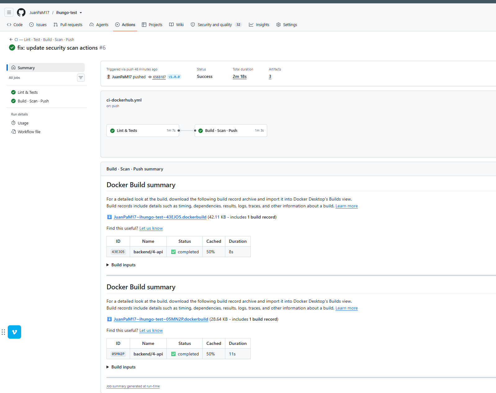
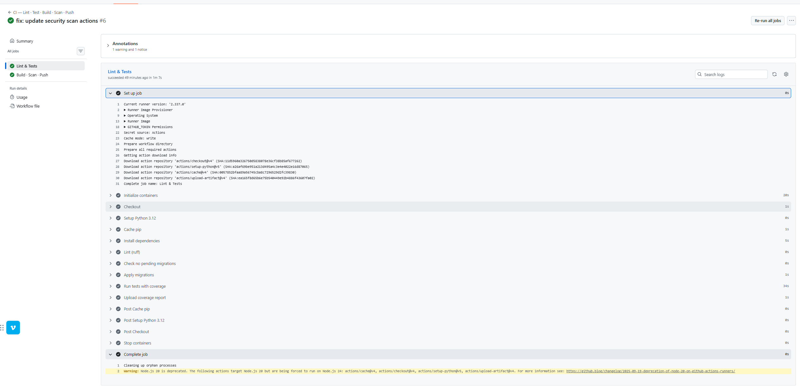
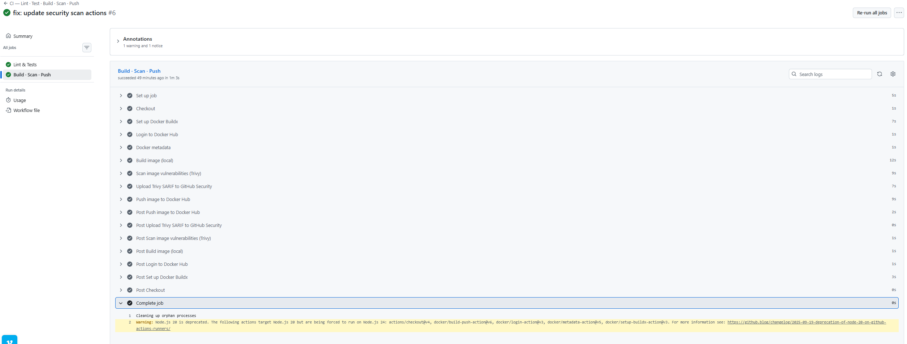
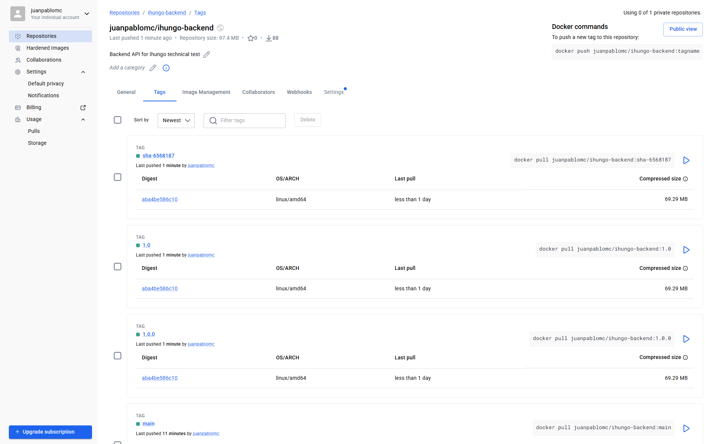

# EVIDENCIAS — Prueba Técnica Ihungo DevOps


# DevOps 1 — GitHub Actions → Docker Hub

## 1. Objetivo

Automatizar la validación, construcción, escaneo y publicación de la imagen Docker correspondiente al Backend 4 mediante GitHub Actions.

La imagen publicada corresponde a la API desarrollada en `backend/4-api/`.

El flujo implementado es:

```text
Push / Pull Request / Tag
          |
          v
   GitHub Actions
          |
          +--> Lint
          |
          +--> Tests + cobertura
          |
          +--> Docker Build
          |
          +--> Escaneo Trivy
          |
          +--> Push a Docker Hub
                 |
                 +--> main
                 +--> sha-<commit>
```

---

## 2. Repositorios utilizados

### Repositorio principal

GitLab:

```text
https://gitlab.com/personal-group5360139/ihungo-test
```

### Espejo para GitHub Actions

GitHub:

```text
https://github.com/JuanPaM17/ihungo-test
```

El repositorio de GitHub se utiliza como espejo del repositorio principal para ejecutar GitHub Actions.

---

## 3. Repositorio de Docker Hub

Repositorio público:

```text
https://hub.docker.com/r/juanpablomc/ihungo-backend
```

Página de etiquetas:

```text
https://hub.docker.com/r/juanpablomc/ihungo-backend/tags
```

Etiquetas verificadas:

```text
main
sha-6568187
```

También se utilizó inicialmente una etiqueta manual:

```text
test
```

para validar el flujo `docker build` + `docker push` antes de automatizarlo.

---

## 4. Pipeline implementado

Archivo:

```text
.github/workflows/ci-dockerhub.yml
```

El pipeline contiene dos bloques principales.

### 4.1. Job `Lint & Tests`

Se ejecuta antes de cualquier construcción de imagen.

Incluye:

```text
ruff check .
python manage.py makemigrations --check --dry-run
python manage.py migrate --noinput
pytest --cov=. --cov-report=term-missing --cov-report=xml --cov-fail-under=80
```

El objetivo es impedir que una imagen se publique si el código no supera previamente las validaciones de calidad.

### 4.2. Job `Build · Scan · Push`

Depende del job anterior.

Incluye:

- configuración de Docker Buildx;
- autenticación contra Docker Hub únicamente cuando corresponde;
- generación de metadatos y etiquetas;
- build local de la imagen;
- análisis de vulnerabilidades con Trivy;
- push de la imagen a Docker Hub para `main` y tags.

---

# 5. Evidencias

## Evidencia 1 — Ejecución exitosa en `main`

**Qué demuestra**

- que GitHub Actions se ejecutó correctamente;
- que `Lint & Tests` pasó;
- que `Build · Scan · Push` pasó;
- que el pipeline completo funciona desde `main`.

**Enlace al run**

[Ver ejecución en GitHub Actions](https://github.com/JuanPaM17/ihungo-test/actions/runs/36473605121)

**Captura**



---

## Evidencia 2 — Lint y pruebas exitosas

**Qué demuestra**

- que el código pasa `ruff`;
- que las migraciones están versionadas;
- que las pruebas automatizadas pasan;
- que se exige cobertura mínima del 80 %.

**Captura**



---

## Evidencia 3 — Build, escaneo y push

**Qué demuestra**

- que la imagen Docker se construye;
- que Trivy analiza la imagen;
- que la imagen se publica en Docker Hub.

**Captura**



---

## Evidencia 4 — Etiquetas trazables en Docker Hub

**Qué demuestra**

Que la imagen puede relacionarse con:

- una rama;
- una versión semántica;
- un commit específico.

Etiquetas utilizadas:

```text
main
sha-<commit>
```

**Captura**



# 6. Defectos identificados y corregidos — DevOps 1

La definición de referencia contenía defectos intencionales. Se corrigieron los siguientes.

## FIX-1 — Construcción sin validación previa

### Problema

El workflow de referencia construía y publicaba la imagen sin ejecutar lint ni pruebas previamente.

### Riesgo

Una imagen con errores de código o regresiones podía publicarse en Docker Hub.

### Corrección

Se creó un job independiente:

```text
Lint & Tests
```

que ejecuta:

- `ruff`;
- validación de migraciones;
- migraciones;
- `pytest`;
- cobertura mínima del 80 %.

El job:

```text
Build · Scan · Push
```

depende explícitamente de este job.

### Resultado

Una imagen solo puede construirse y publicarse después de superar las validaciones de calidad.

---

## FIX-2 — Publicación durante Pull Requests

### Problema

La referencia utiliza `push: true` sin diferenciar adecuadamente entre eventos.

### Riesgo

Un Pull Request podría intentar publicar una imagen aunque su propósito sea únicamente validar cambios.

### Corrección

Los Pull Requests ejecutan:

- lint;
- pruebas;
- build;
- escaneo;

pero no realizan push a Docker Hub.

La publicación se limita a:

- `main`;
- tags `v*`.

### Resultado

Los PR sirven como validación sin producir artefactos publicados.

---

## FIX-3 — Ausencia de escaneo de vulnerabilidades

### Problema

El workflow de referencia no analizaba vulnerabilidades de la imagen Docker.

### Riesgo

La imagen podía publicarse con vulnerabilidades conocidas sin ninguna evidencia de análisis.

### Corrección

Se incorporó Trivy al pipeline.

La imagen se construye localmente antes de publicar y es analizada mediante:

```text
Scan image vulnerabilities (Trivy)
```

El resultado se genera además en formato SARIF.

### Resultado

Existe evidencia automatizada del análisis de seguridad de la imagen.

---

## FIX-4 — Etiquetado insuficientemente trazable

### Problema

Utilizar únicamente etiquetas genéricas como `latest` dificulta conocer qué commit originó una imagen.

### Riesgo

Se pierde trazabilidad entre código fuente e imagen desplegada.

### Corrección

Se generaron etiquetas basadas en:

```text
main
sha-<commit>
```

Y cuando se publique un tag semántico:

```text
vX.Y.Z → X.Y.Z / X.Y
```

### Resultado

Es posible relacionar cada imagen con su rama, versión o commit.

---

## FIX-5 — Uso innecesario de credenciales en Pull Requests

### Problema

Realizar login en Docker Hub en ejecuciones que no necesitan publicar imágenes incrementa innecesariamente el uso de secretos.

### Riesgo

Mayor superficie de exposición de credenciales.

### Corrección

El step:

```text
Login to Docker Hub
```

solo se ejecuta cuando el evento no es `pull_request`.

### Resultado

Las credenciales se utilizan únicamente en escenarios que realmente requieren publicación.

---

# 7. Mejoras realizadas al Dockerfile

La imagen del Backend 4 también fue ajustada para cumplir criterios de seguridad y optimización.

## Multi-stage build

Se separó la instalación de dependencias de la imagen final.

### Beneficio

La imagen de runtime no necesita contener herramientas utilizadas únicamente durante construcción.

---

## Ejecución como usuario no root

La aplicación se ejecuta utilizando un usuario sin privilegios.

### Beneficio

Se reduce el impacto potencial de una vulnerabilidad dentro del contenedor.

---

## Optimización de caché

Las dependencias se instalan antes de copiar todo el código.

### Beneficio

Docker puede reutilizar capas cuando el archivo de dependencias no cambia.

---

## `.dockerignore`

Se excluyen archivos que no deben formar parte del contexto de construcción.

Entre ellos:

```text
.env
.git
__pycache__
.pytest_cache
.mypy_cache
.ruff_cache
venv
```

### Beneficio

- reduce el contexto de build;
- evita copiar archivos innecesarios;
- evita incorporar secretos accidentalmente.

---

# 8. Secrets utilizados

GitHub Actions utiliza:

```text
DOCKERHUB_USERNAME
DOCKERHUB_TOKEN
```

Estos valores se configuran en:

```text
GitHub
→ Settings
→ Secrets and variables
→ Actions
```

Ningún valor real se encuentra versionado en el repositorio.

---

# 9. Resultado DevOps 1

Se verificó:

- repositorio espejo en GitHub;
- pipeline ejecutado desde GitHub Actions;
- lint antes del build;
- pruebas antes del build;
- cobertura mínima;
- Docker build exitoso;
- escaneo de vulnerabilidades;
- publicación automática a Docker Hub;
- publicación solo desde `main` y tags `v*`;
- etiquetas trazables (`main`, `sha-<commit>`, `vX.Y.Z`);
- uso de secrets;
- Dockerfile multi-stage;
- usuario no root;
- exclusión de secretos del contexto de Docker.

---

# DevOps 3 — Despliegue en k3s

> Esta sección se completará durante la ejecución del Reto DevOps 3.

## Evidencias esperadas

Se deberán documentar como mínimo:

- recursos creados en el namespace;
- Deployment funcionando;
- Pods en estado `Running`;
- Service `NodePort`;
- acceso exitoso a `/api/health/`;
- configuración mediante ConfigMap y Secret;
- readiness probe;
- liveness probe;
- recursos configurados;
- imagen con etiqueta inmutable;
- rolling update sin caída del servicio.

### Evidencia — Recursos del clúster

```text
[AGREGAR CAPTURA / ENLACE]
```

### Evidencia — Health check a través del Service

```text
[AGREGAR CAPTURA / ENLACE]
```

### Evidencia — Probes

```text
[AGREGAR CAPTURA / ENLACE]
```

### Evidencia — Rolling update

```text
[AGREGAR CAPTURA / ENLACE]
```

---

## Defectos corregidos — DevOps 3

### FIX-1 — Namespace `default` usado directamente

**Problema**

Los manifiestos de referencia despliegan recursos en el namespace `default`, compartido con otros workloads del clúster.

**Riesgo**

Falta de aislamiento: recursos de distintas aplicaciones conviven sin separación, dificultando la gestión de permisos, quotas y limpieza.

**Corrección**

Se creó un namespace dedicado `ihungo` con labels de aplicación. Todos los recursos del reto se despliegan dentro de él.

**Archivo:** `namespace.yaml`

---

### FIX-2 — ConfigMap mezclando valores sensibles y no sensibles

**Problema**

Los manifiestos de referencia colocan credenciales como `POSTGRES_PASSWORD` o `DJANGO_SECRET_KEY` en el ConfigMap junto con configuración ordinaria.

**Riesgo**

Los ConfigMap no están cifrados en etcd. Cualquier usuario con acceso de lectura al namespace puede obtener las credenciales.

**Corrección**

Separación estricta: valores no sensibles en `configmap.yaml`, credenciales en `secret.yaml` de tipo `Opaque`. El Secret se creó desde CLI con `kubectl create secret generic` usando `openssl rand` para los valores reales, sin versionar credenciales en Git.

**Archivos:** `configmap.yaml`, `secret.yaml`

---

### FIX-3 — Secret versionado con credenciales reales en base64

**Problema**

Los manifiestos de referencia incluyen el `secret.yaml` con valores reales codificados en base64 y lo suben al repositorio.

**Riesgo**

Base64 no es cifrado. Cualquiera con acceso al repositorio puede decodificar las credenciales con `base64 -d`. La penalización del reto es -15 puntos.

**Corrección**

El `secret.yaml` versionado contiene únicamente placeholders explícitamente identificados. El Secret real se creó localmente con:

```bash
kubectl create secret generic ihungo-secret \
  --from-literal=DJANGO_SECRET_KEY="$(openssl rand -base64 48)" \
  --from-literal=POSTGRES_USER="ihungo_user" \
  --from-literal=POSTGRES_PASSWORD="$(openssl rand -base64 32)" \
  --namespace=ihungo
```

Las variables se hicieron `unset` tras la creación.

**Archivo:** `secret.yaml`

---

### FIX-4 — Deployment sin readinessProbe

**Problema**

Los manifiestos de referencia no definen `readinessProbe`. Kubernetes envía tráfico al pod en cuanto el contenedor arranca, antes de que Django haya completado la inicialización.

**Riesgo**

Los primeros requests reciben errores 502/503 porque la aplicación aún no está lista para atender tráfico.

**Corrección**

Se agregó `readinessProbe` sobre el endpoint real del proyecto `/api/health/` con `initialDelaySeconds: 15` y `failureThreshold: 3`.

**Archivo:** `deployment.yaml`

---

### FIX-5 — Deployment sin requests ni limits de recursos

**Problema**

Los manifiestos de referencia no definen `resources`. Kubernetes no puede planificar correctamente los pods ni proteger el nodo.

**Riesgo**

Un pod con fuga de memoria puede consumir todos los recursos del nodo y derribar otros workloads. En un nodo de un solo control-plane como este clúster, eso derriba k3s completo.

**Corrección**

Se definieron `requests` y `limits` tanto para el backend como para PostgreSQL:

```yaml
resources:
  requests:
    cpu: "100m"
    memory: "256Mi"
  limits:
    cpu: "500m"
    memory: "512Mi"
```

**Archivo:** `deployment.yaml`, `postgres.yaml`

---

### FIX-6 — Imagen con etiqueta mutable (`latest` o `main`)

**Problema**

Los manifiestos de referencia usan `latest` o una etiqueta de rama como `main`. Ambas son mutables: apuntan a imágenes distintas en momentos distintos.

**Riesgo**

No hay trazabilidad entre el manifiesto y el código que realmente está corriendo. Un redeploy puede traer una versión diferente sin cambiar el YAML.

**Corrección**

Se usa la etiqueta inmutable `sha-6568187`, que corresponde al SHA del commit que generó la imagen. Se combina con `imagePullPolicy: IfNotPresent` para coherencia con etiquetas fijas.

**Archivo:** `deployment.yaml`

---

### FIX-7 — Variables de entorno hardcodeadas en el Deployment

**Problema**

Los manifiestos de referencia definen variables de entorno directamente en el Deployment con valores literales, incluyendo credenciales.

**Riesgo**

Duplicación de configuración, credenciales expuestas en el manifiesto y acoplamiento entre el Deployment y los valores de entorno.

**Corrección**

Todas las variables se inyectan desde fuentes externas:

- Configuración no sensible → `configMapKeyRef` apuntando a `ihungo-config`
- Credenciales → `secretKeyRef` apuntando a `ihungo-secret`

**Archivo:** `deployment.yaml`
