# Evidencias — IA 1

Este documento reúne las evidencias visuales de la implementación y validación del reto **IA 1 — Agente conversacional con LLM**.

Las capturas se encuentran en:

```text
ia/1-agente/screenshots/
```

---

# 1. Autenticación y perfiles

## 1.1 Login como administrador

La siguiente captura evidencia el inicio de sesión con un usuario administrador y la obtención de una sesión autenticada para operar el agente con permisos administrativos.

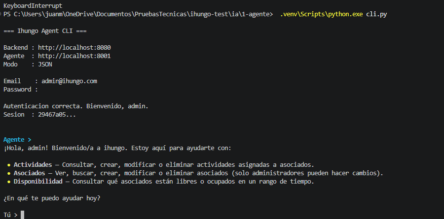

## 1.2 Login como asociado

La siguiente captura evidencia el inicio de sesión con un usuario asociado, permitiendo validar posteriormente las restricciones y operaciones disponibles según su rol.

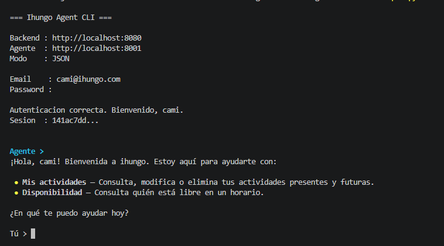

---

# 2. Operaciones como administrador

## 2.1 Consulta general de actividades

La siguiente captura evidencia que el agente puede consultar actividades mediante lenguaje natural y utilizar las herramientas correspondientes del Backend 4.

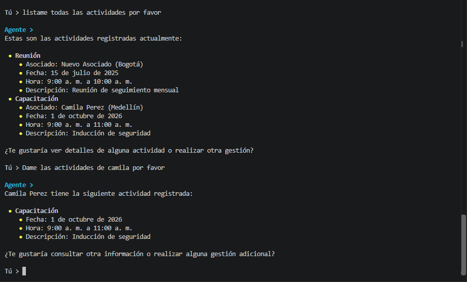

## 2.2 Búsqueda de asociado

La siguiente captura evidencia el uso de la herramienta de búsqueda de asociados, permitiendo localizar registros a partir de los datos disponibles en Backend 4.

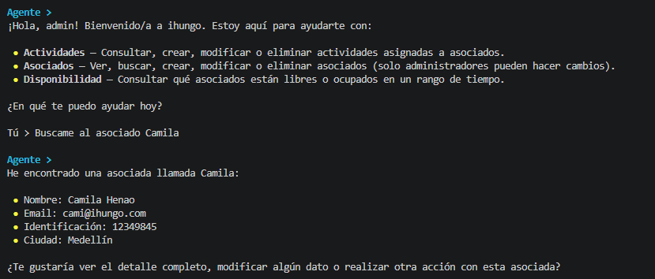

## 2.3 Creación de asociado

La siguiente captura evidencia el flujo de creación de un asociado desde el agente utilizando un usuario con permisos administrativos.

La operación utiliza el JWT del usuario autenticado y Backend 4 conserva la autoridad final sobre los permisos.

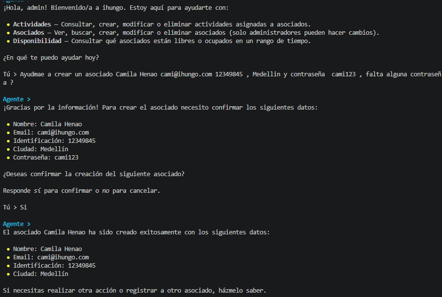

## 2.4 Actualización de asociado

La siguiente captura evidencia la actualización de datos de un asociado mediante el agente y la herramienta correspondiente.

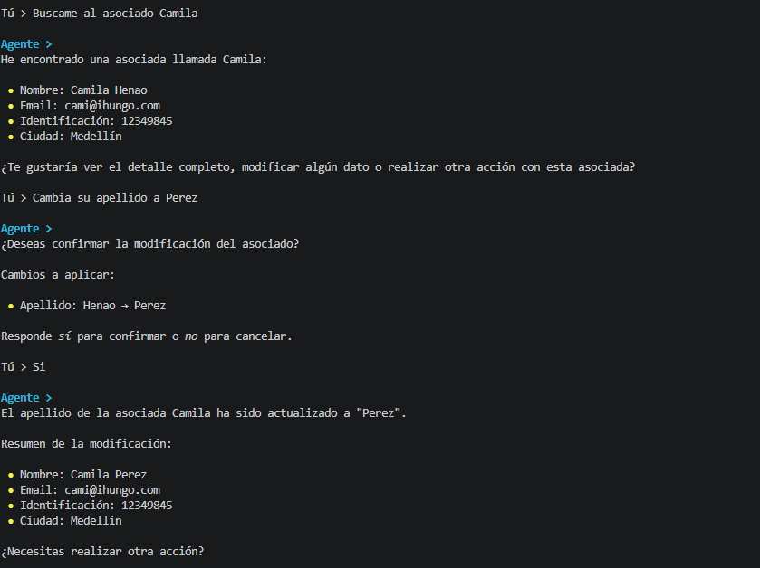

## 2.5 Creación de actividad

La siguiente captura evidencia la creación de una actividad desde el agente, incluyendo la selección del asociado, los datos temporales y la interacción con la API.

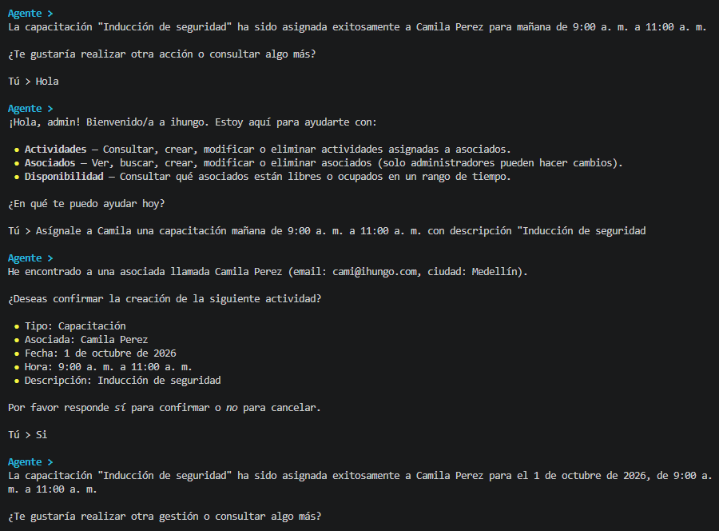

## 2.6 Reprogramación de actividad

La siguiente captura evidencia el flujo de reprogramación de una actividad existente, modificando su fecha u horario mediante el agente.

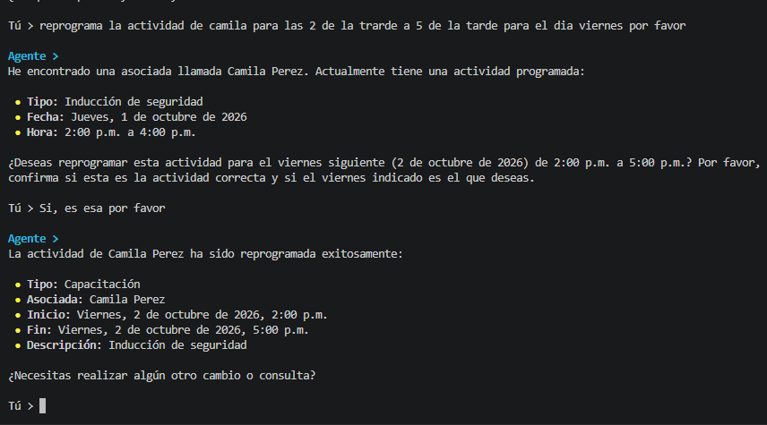

---

# 3. Operaciones como asociado

## 3.1 Consulta de mis actividades

La siguiente captura evidencia que el usuario asociado puede consultar las actividades visibles para él según su JWT y las reglas de autorización definidas en Backend 4.

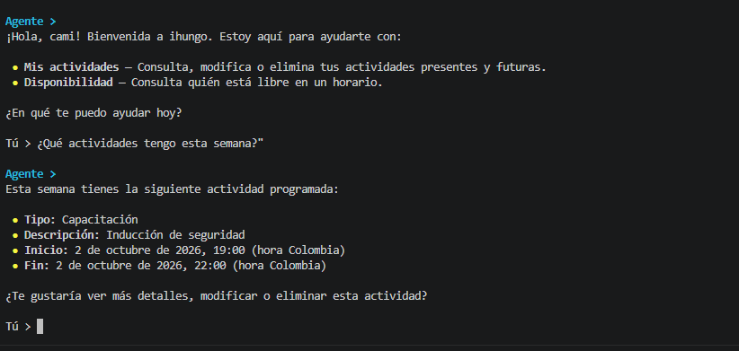

## 3.2 Mover mi actividad

La siguiente captura evidencia que un asociado puede solicitar la reprogramación de una actividad propia o relacionada con él, siempre que las reglas del Backend permitan la operación.

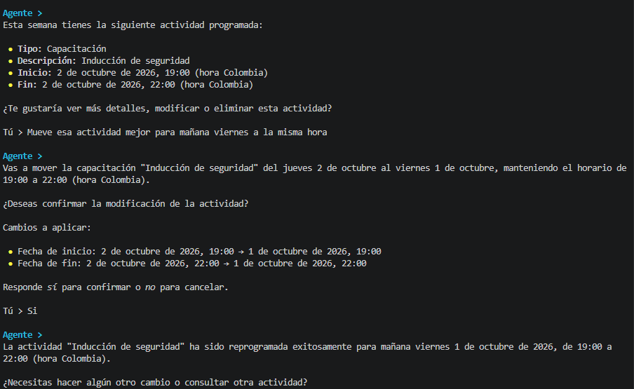

## 3.3 Eliminar mi actividad

La siguiente captura evidencia la eliminación de una actividad sobre la cual el asociado tiene permisos, manteniendo Backend 4 como autoridad final de autorización.

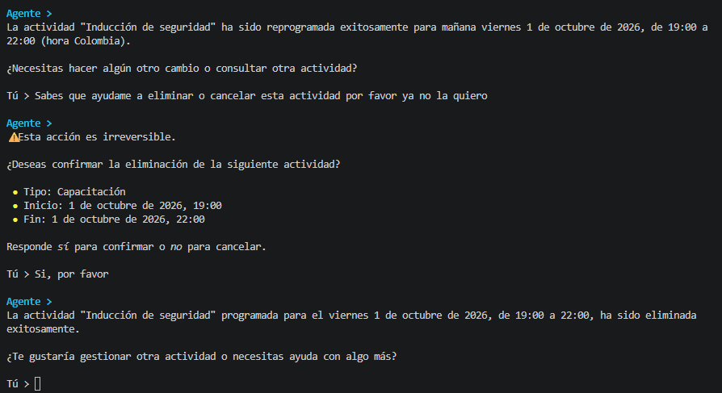

---

# 4. Persistencia y validación en base de datos

## 4.1 Usuarios registrados

La siguiente captura evidencia los usuarios persistidos en el sistema después de las operaciones realizadas durante las pruebas.

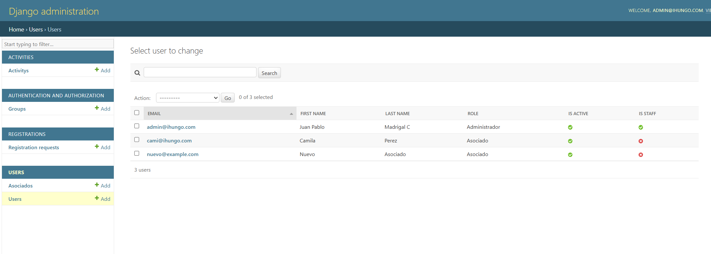

## 4.2 Actividades registradas

La siguiente captura evidencia las actividades persistidas en el sistema y permite contrastar que las operaciones realizadas desde el agente fueron almacenadas correctamente.

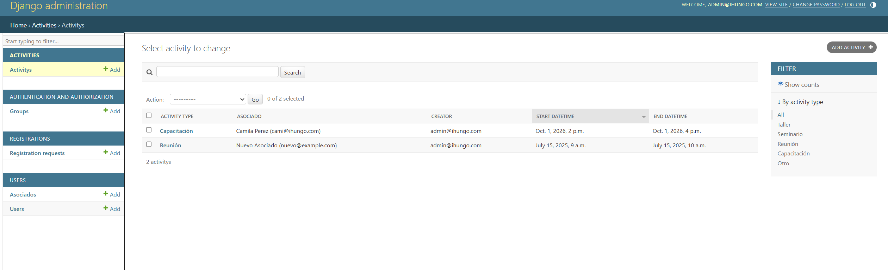

---

# 5. Resumen de evidencias

| Categoría | Evidencia | Archivo |
|---|---|---|
| Autenticación | Login administrador | `screenshots/login_admin.png` |
| Autenticación | Login asociado | `screenshots/login_asociado.png` |
| Actividades | Consulta general de actividades | `screenshots/consulta_actividades.png` |
| Asociados | Buscar asociado | `screenshots/buscar_asociado.png` |
| Asociados | Crear asociado | `screenshots/crear_asociado.png` |
| Asociados | Actualizar asociado | `screenshots/actualizar_asociado.png` |
| Actividades | Crear actividad | `screenshots/crear_actividad.png` |
| Actividades | Reprogramar actividad | `screenshots/reprogramar_actividad.png` |
| Asociado | Consultar mis actividades | `screenshots/consultar_mis_actividades.png` |
| Asociado | Mover mi actividad | `screenshots/mover_mi_actividad.png` |
| Asociado | Eliminar mi actividad | `screenshots/eliminar_mi_actividad.png` |
| Persistencia | Usuarios en base de datos | `screenshots/bd_usuarios.png` |
| Persistencia | Actividades en base de datos | `screenshots/bd_actividad.png` |

---

# 6. Cobertura demostrada

Las capturas anteriores permiten evidenciar:

- autenticación con perfiles de administrador y asociado;
- uso del JWT del usuario autenticado;
- diferencias de operación según permisos;
- consulta general de actividades;
- consulta de actividades visibles para el asociado;
- búsqueda de asociados;
- creación y actualización de asociados con permisos administrativos;
- creación de actividades;
- reprogramación de actividades;
- reprogramación de una actividad propia por parte de un asociado;
- eliminación de una actividad autorizada;
- interacción del agente con Backend 4 mediante herramientas;
- persistencia real de usuarios y actividades;
- separación entre la lógica conversacional del agente y la autorización final del Backend 4.

